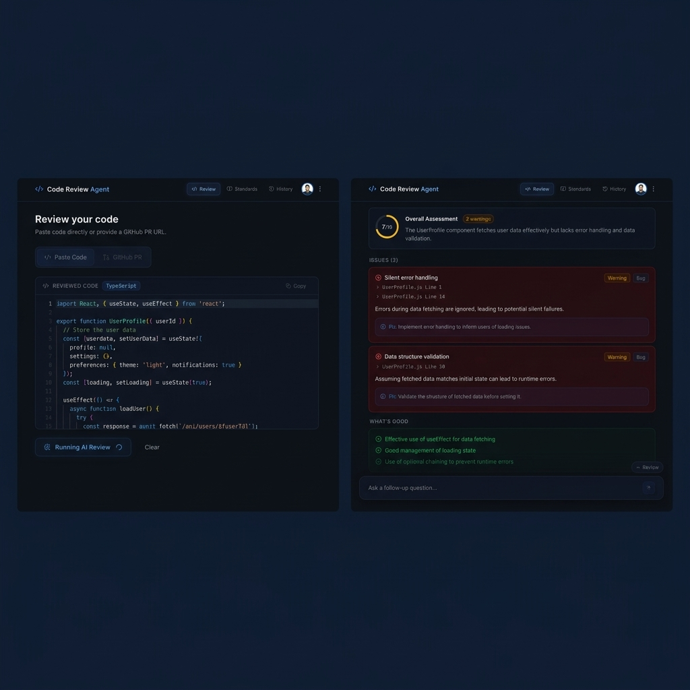

# Code Review Agent

> AI-powered code review for pasted snippets and GitHub Pull Requests — streamed in real time, scored, stored, and interactive.



---

## What It Does

Code Review Agent is a full-stack SaaS tool that performs automated, AI-driven code reviews. You sign in with GitHub, submit either a block of pasted code or a public GitHub PR URL, and receive a structured, real-time review covering:

- **Bugs & correctness** issues with precise file/line locations
- **Security vulnerabilities** with severity ratings
- **Performance** and **style** observations
- **Positives** — genuine strengths the AI found in the code
- A **quality score** from 1–10

Reviews are saved to your history and you can follow up with a chat interface to ask questions about any issue.

---

## Key Features

- **Two review modes** — paste raw code or point at a GitHub PR URL
- **Streamed output** — review progress streams live via SSE; you see the AI thinking in real time
- **Multi-agent clustered PR review** — large PRs are split into domain clusters (e.g. Auth, DB, API), each reviewed by an independent parallel agent, then synthesised into one report
- **ESLint integration** — the AI can invoke a server-side linter as a tool during the review
- **RAG-powered custom standards** — upload your team's coding standards (PDF, text, or Markdown); they are vectorised and injected into review prompts automatically
- **Review history** — all reviews are persisted with full trace logs and scores; re-open any past review
- **Follow-up chat** — ask questions about any completed review in a persistent, context-aware conversation
- **GitHub OAuth** — sign in with GitHub; the token is used as the auth credential throughout
- **Queue-backed pipeline** — reviews run as background jobs (BullMQ + Redis), decoupling long AI runs from HTTP requests and replaying late SSE connections

---

## Architecture Overview

```
┌─────────────────────────────────────────────────────────────────┐
│                        Browser (Next.js)                        │
│  GitHub OAuth → Review Page → SSE Stream → History / Chat       │
└────────────────────────┬────────────────────────────────────────┘
                         │ HTTPS
┌────────────────────────▼────────────────────────────────────────┐
│                     NestJS API Server                           │
│                                                                 │
│  POST /review/session ──► QueueService ──► BullMQ Queue         │
│  GET  /review/:id/stream ─────────────────────────────────┐     │
│                                                           │     │
│  ┌─────────────────────────────────────────────────────┐  │     │
│  │              ReviewProcessor (BullMQ Worker)        │  │     │
│  │                                                     │  │     │
│  │  RAG Retrieval ──► AI Pipeline ──► emit events      │  │     │
│  │       ▲                │                  │         │  │     │
│  │  pgvector         streamText()        Redis pub/sub │  │     │
│  │  (Neon DB)    (OpenAI gpt-4o-mini)  replay list    │  │     │
│  └──────────────────────────────────────┬──────────────┘  │     │
│                                         │                 │     │
│                                    Redis ◄────────────────┘     │
│                                         │                       │
│  ReviewStreamerService ◄────────────────┘                       │
│  (replays history + subscribes live)                            │
└─────────────────────────────────────────────────────────────────┘
                         │
              ┌──────────┴──────────┐
         Neon PostgreSQL        Redis (Upstash / Render)
         (pgvector)             (BullMQ + pub/sub + replay)
```

**Flow in plain English:**
1. User submits code or a PR URL → server creates a DB record and enqueues a job → returns `reviewId`.
2. Client navigates to `/review/:type/:reviewId` and opens an SSE stream.
3. BullMQ worker picks up the job, runs the AI pipeline (including optional RAG context and linting), and emits events to Redis.
4. `ReviewStreamerService` replays any already-emitted events to the client, then subscribes live.
5. On completion, the final review is persisted to PostgreSQL and the SSE stream closes cleanly.

---

## Tech Stack

| Layer | Technology |
|---|---|
| **Frontend** | Next.js 16 (App Router), NextAuth.js, Tailwind CSS, Monaco Editor |
| **Backend** | NestJS (Node.js), BullMQ, ioredis |
| **AI** | OpenAI gpt-4o-mini via Vercel AI SDK (`streamText`, `generateText`, `generateObject`) |
| **Embeddings** | `text-embedding-3-small` via Vercel AI SDK |
| **Database** | PostgreSQL (Neon) with `pgvector` extension, Prisma ORM |
| **Queue / Pub-Sub** | Redis (BullMQ jobs + pub/sub event channel + SSE replay list) |
| **Auth** | GitHub OAuth (NextAuth on client, token validation via GitHub `/user` API on server) |
| **Monorepo** | pnpm workspaces |
| **Deployment** | Server → Render.com · Client → Vercel |
| **Containerisation** | Docker + Docker Compose (local) |

---

## Monorepo Structure

```
code-review-agent/
├── apps/
│   ├── client/               # Next.js 16 frontend
│   │   ├── app/              # App Router pages (review, history, standards, login)
│   │   ├── components/       # UI components (review/, history/, layout/, ui/)
│   │   └── lib/              # Hooks, SSE consumer, stream reducer, API client
│   └── server/               # NestJS backend
│       ├── src/
│       │   ├── ai/           # OpenAI provider setup
│       │   ├── auth/         # GitHub token validation, AuthGuard, token cache
│       │   ├── github/       # GitHub API client (diff, files, file content)
│       │   ├── history/      # Review history, follow-up chat
│       │   ├── linter/       # In-process ESLint tool
│       │   ├── prisma/       # Prisma client service
│       │   ├── queue/        # BullMQ setup, Redis service, SSE emitter
│       │   ├── rag/          # Document ingestion, vector retrieval
│       │   ├── review/       # Core review pipeline, SSE, processor, repository
│       │   └── users/        # User upsert service
│       └── prisma/
│           └── schema.prisma # Database schema
├── packages/
│   ├── ai/                   # Shared: prompts, AI tools, cluster planner, embeddings
│   └── types/                # Shared: Zod schemas, ReviewStreamEvent union type
├── docker-compose.yml        # Local all-in-one (Redis + server + client)
├── render.yaml               # Render.com deployment config
└── pnpm-workspace.yaml
```

---

## Local Development

### Prerequisites

- Node.js ≥ 20
- pnpm ≥ 10 (`npm install -g pnpm`)
- Docker (only needed for the Docker Compose path)
- A Redis instance (local Docker or cloud)
- A PostgreSQL database with the `pgvector` extension (local or [Neon](https://neon.tech))

### 1. Clone and install dependencies

```bash
git clone https://github.com/Kashif-Rezwi/code-review-agent.git
cd code-review-agent
pnpm install
```

### 2. Configure environment variables

**Backend** — copy and fill in `apps/server/.env`:

```bash
cp apps/server/.env.example apps/server/.env
```

| Variable | Description |
|---|---|
| `DATABASE_URL` | Neon (or any Postgres) pooled connection string |
| `DIRECT_URL` | Neon direct connection string (for Prisma migrations) |
| `OPENAI_API_KEY` | OpenAI API key (required) |
| `REDIS_URL` | Redis connection string, e.g. `redis://localhost:6379` |
| `GITHUB_CLIENT_ID` | GitHub OAuth App client ID |
| `GITHUB_CLIENT_SECRET` | GitHub OAuth App client secret |
| `FRONTEND_URL` | Frontend origin for CORS, e.g. `http://localhost:3000` |
| `PORT` | Server port (default `4000`) |
| `GITHUB_TOKEN` | *(Optional)* Personal access token for private repo PR reviews |
| `HELICONE_API_KEY` | *(Optional)* Observability via Helicone |
| `GROQ_API_KEY` | *(Optional)* Alternative AI provider |

**Frontend** — copy and fill in `apps/client/.env`:

```bash
cp apps/client/.env.example apps/client/.env
```

| Variable | Description |
|---|---|
| `NEXTAUTH_URL` | Full public URL of the frontend, e.g. `http://localhost:3000` |
| `NEXTAUTH_SECRET` | Random secret for NextAuth session encryption |
| `GITHUB_CLIENT_ID` | Same GitHub OAuth App client ID as above |
| `GITHUB_CLIENT_SECRET` | Same GitHub OAuth App client secret as above |
| `NEXT_PUBLIC_API_URL` | Backend URL, e.g. `http://localhost:4000` |

### 3. Run database migrations

```bash
cd apps/server
npx prisma migrate deploy
```

### 4. Start the development servers

```bash
# From the monorepo root — starts both client and server
pnpm dev
```

The frontend runs at `http://localhost:3000` and the API at `http://localhost:4000`.

---

## Running with Docker Compose

Docker Compose runs Redis, the NestJS server, and the Next.js client together. Make sure both `.env` files are filled in first.

```bash
# Build and start all services
docker compose up --build

# Or in detached mode
docker compose up --build -d
```

Services:
- **Redis** → `localhost:6379`
- **API** → `http://localhost:4000`
- **Frontend** → `http://localhost:3000`

---

## Deployment

| Target | Service | Config file |
|---|---|---|
| **API + Redis** | [Render.com](https://render.com) | [`render.yaml`](./render.yaml) |
| **Frontend** | [Vercel](https://vercel.com) | [`apps/client/vercel.json`](./apps/client/vercel.json) |

Set all required environment variables in the Render and Vercel dashboards. The `render.yaml` provisions a managed Redis instance and wires `REDIS_URL` automatically.

---

## Documentation

Detailed design documents for each subsystem live in the [`docs/`](./docs/) directory.

| Document | Description |
|---|---|
| [docs/architecture.md](./docs/architecture.md) | Full system architecture and component diagram |
| [docs/authentication.md](./docs/authentication.md) | GitHub OAuth, token validation, AuthGuard, user model |
| [docs/review-code.md](./docs/review-code.md) | Code review pipeline (single-agent) |
| [docs/review-pr.md](./docs/review-pr.md) | PR review pipeline (multi-agent clustered) |
| [docs/queue-streaming.md](./docs/queue-streaming.md) | BullMQ, Redis pub/sub, SSE transport layer |
| [docs/github-integration.md](./docs/github-integration.md) | GitHub API usage, rate limits, pagination |
| [docs/rag.md](./docs/rag.md) | Document ingestion, vector embeddings, retrieval |
| [docs/history-chat.md](./docs/history-chat.md) | Review history, follow-up chat, stats |
| [docs/data-model.md](./docs/data-model.md) | Prisma schema: all models and relations |
| [docs/frontend.md](./docs/frontend.md) | Next.js architecture, hooks, reducers, components |
| [docs/packages.md](./docs/packages.md) | `@cra/ai` and `@cra/types` shared packages |
| [docs/deployment.md](./docs/deployment.md) | Render, Vercel, Docker Compose, env var reference |
