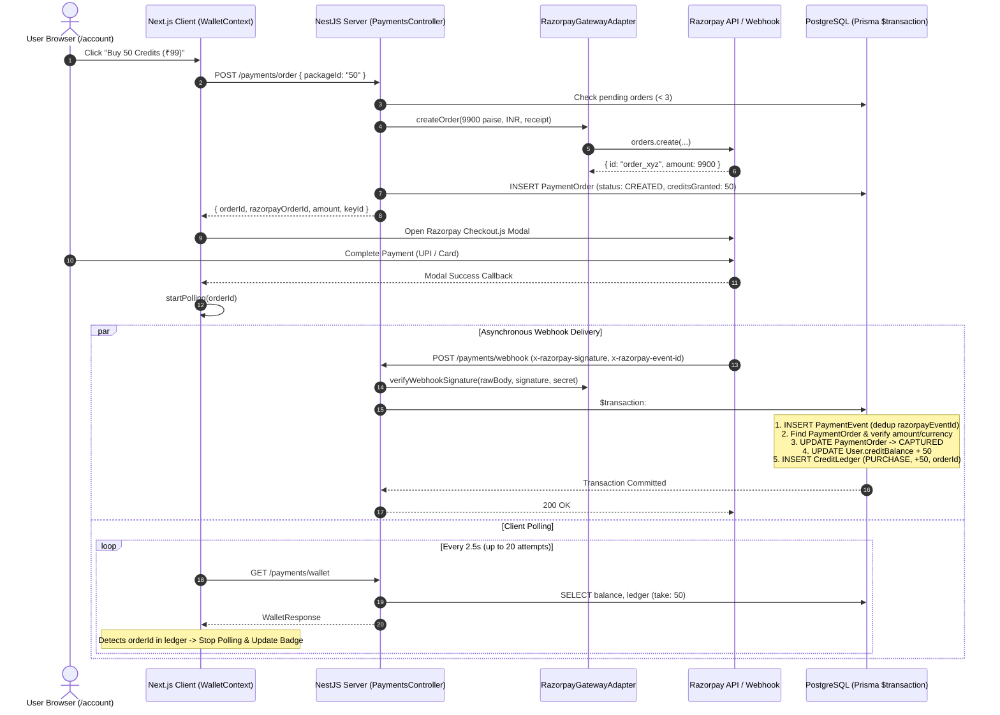
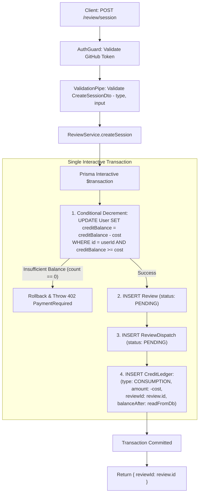
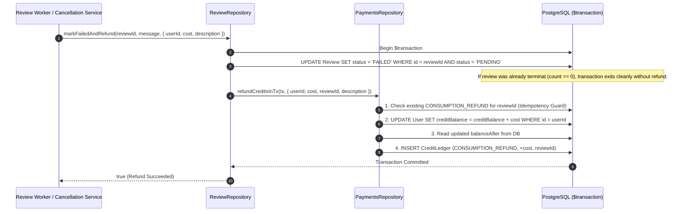

# Razorpay Payment & Credit Wallet Subsystem — Target Architecture Blueprint

> **Document Version:** 1.0.0  
> **Status:** Approved Target Architecture  
> **Target System:** Code Review Agent (`apps/server`, `apps/client`, `packages/types`)  
> **Scope:** Payment Processing, Prepaid Credit Ledger, Review/Chat Consumption Lifecycle, Concurrency & Security Controls, State Synchronization, and Operational Telemetry.  
> **Primary Authority:** This document defines the authoritative target design and supersedes prior architectural explorations.

---

## 1. Executive Summary & Architectural Vision

The **Code Review Agent** employs a **prepaid credit wallet model** to monetize AI-powered code reviews. Users purchase credit packs denominated in Indian Rupees (INR) via Razorpay, and consume credits to execute single-file reviews (5 credits), multi-agent clustered pull request reviews (10 credits), and follow-up interactive chat sessions (1 credit).

```
┌──────────────────────────────────────────────────────────────────────────────────────────────────┐
│                                   CORE ARCHITECTURAL NORTH STAR                                  │
├──────────────────────────────────────────────────────────────────────────────────────────────────┤
│ 1. Zero Trust in Client Financial State: Pricing, costs, and grants are strictly server-side.    │
│ 2. Webhook-Exclusive Entitlement: Only HMAC-verified Razorpay webhooks grant credits.            │
│ 3. Atomic In-Transaction Consumption: Credits are checked and deducted within domain creation    │
│    transactions, guaranteeing millisecond-zero entity linkage (reviewId) and zero refund churn.  │
│ 4. Single Financial Authority: PaymentsRepository owns all balance & ledger mutations.           │
│ 5. Universal Client Wallet Synchronization: A single React Context synchronizes wallet state.    │
└──────────────────────────────────────────────────────────────────────────────────────────────────┘
```

---

## 2. Current State vs. Target Architecture: Audit Findings Resolution

The comprehensive audit in [`docs/audit/razorpay-credit-architecture-audit.md`](file:///Users/kashifrezwi/Developer/code-review-agent/docs/audit/razorpay-credit-architecture-audit.md) identified 14 architectural findings (`RZC-001` through `RZC-014`). The target architecture addresses 100% of these findings:

| Finding ID | Audit Finding Summary | Target Architectural Resolution | Primary ADR / Component |
|---|---|---|---|
| **RZC-001** | `ReviewRepository` directly mutates `User.creditBalance` and `CreditLedger` | All balance & ledger updates are encapsulated in `PaymentsRepository`. `ReviewRepository` calls `PaymentsRepository.refundCreditsInTx` within its interactive transaction. | ADR-007, `PaymentsRepository` |
| **RZC-002** | Dead code: `refundCreditsInTx` unused in payments service/repo | Activated as the single standard transactional refund pipeline used across review cancellations and worker failures. | ADR-007, `PaymentsService` |
| **RZC-003** | `CONSUMPTION` ledger rows persisted with `reviewId = null` | Retired `CreditGuard` pre-deduction. Review creation and credit deduction occur atomically in `ReviewService.createSession`, guaranteeing `reviewId` is always populated. | ADR-001, `ReviewService` |
| **RZC-004** | Fragile 3-layer refund architecture across request/worker | Eliminated pre-handler and synchronous handler refund layers. Only background worker failures and explicit cancellations require refunds. | ADR-001, `ReviewService` |
| **RZC-005** | Guard pre-deduction precedes DTO validation, duplicating rules | Retired `CreditGuard`. NestJS `ValidationPipe` runs before any database transaction. Invalid payloads fail with zero database writes. | ADR-001, `ReviewController` |
| **RZC-006** | Client wallet state fragmented across independent hook instances | Introduced a shared `WalletProvider` React Context at the app root, ensuring single-instance caching and synchronized header badge updates. | ADR-005, `WalletContext` |
| **RZC-007** | Brittle client polling termination (`balance > initialBalance`) | Polling checks for targeted `orderId` presence in recent ledger entries or expected balance threshold, eliminating race conditions. | ADR-005, `useWallet` |
| **RZC-008** | Circular module dependency `AuthModule <-> UsersModule <-> PaymentsModule` | Made `AuthModule` `@Global()`, eliminating `forwardRef(() => AuthModule)` and decoupling auth guards from payment providers. | ADR-004, `AuthModule` |
| **RZC-009** | Stale pending order expiration is lazy with no background reaper | Added a scheduled background sweeper to transition abandoned `CREATED` orders older than 30 minutes to `EXPIRED`. | `PaymentsRepository`, Cron |
| **RZC-010** | Denormalized `User.creditBalance` lacks reconciliation routines | Added `reconcileUserBalance` routine and system-wide consistency query to verify `User.creditBalance === SUM(CreditLedger.amount)`. | `PaymentsService`, Drift Query |
| **RZC-011** | Full credit refund emitted after partial chat stream delivery | Standardized chat failure policy: streaming errors before first token refund immediately; mid-stream interruptions fail gracefully. | `HistoryService` |
| **RZC-012** | Absence of operational telemetry & alerts for payment anomalies | Added structured event logging (`PAYMENT_AMOUNT_MISMATCH`, `PAYMENT_UNMATCHED_ORDER`) with severity levels for monitoring integration. | `PaymentsService`, Logger |
| **RZC-013** | Direct coupling to Razorpay SDK in `PaymentsService` | Introduced `RazorpayGatewayAdapter` interface separating HTTP/SDK operations from domain billing logic. | ADR-006, Gateway Adapter |
| **RZC-014** | Webhook controller IP throttler vulnerable behind reverse proxies | Enabled `trust proxy` in NestJS bootstrap and calibrated webhook throttling on gateway headers. | `main.ts`, `WebhookController` |

---

## 3. Core Architectural Goals & Non-Functional Requirements

1. **Financial Correctness & Anti-Double-Spend:** Credits cannot be spent twice or go below zero. Credits are granted exactly once per payment order.
2. **Strict Server-Side Authority:** Prices, packages, costs, and token evaluations are hardcoded server-side in [`credit-cost.policy.ts`](file:///Users/kashifrezwi/Developer/code-review-agent/apps/server/src/payments/credit-cost.policy.ts). No client-supplied amount or credit count is ever trusted.
3. **Idempotent Ingestion:** Duplicate webhooks, out-of-order deliveries, network retries, and concurrent requests produce deterministic results with zero state corruption.
4. **End-to-End Traceability:** Every credit transaction in `CreditLedger` points to its exact originating entity (`orderId` for purchases, `reviewId` for consumptions and refunds).
5. **Clean Domain Boundaries:** Clear ownership boundaries between Authentication, Payments/Billing, Review Engine, and Chat History. No domain leaks its relational queries into another.
6. **Operational Safety & Observability:** Unfulfilled paid orders, currency mismatches, and balance drifts emit structured alerts for operators.

---

## 4. Domain Ownership & Source-of-Truth Matrix

```
┌─────────────────┐       ┌─────────────────┐       ┌─────────────────┐
│   Auth / User   │       │ Payment/Billing │       │  Review Engine  │
│  (UsersService) │       │(PaymentsService)│       │ (ReviewService) │
└────────┬────────┘       └────────┬────────┘       └────────┬────────┘
         │                         │                         │
         │ Upsert User             │ Manage Orders           │ Create Sessions
         │ (GitHub Profile)        │ Ingest Webhooks         │ Execute Pipelines
         │                         │ Manage Credit Ledger    │ Manage Dispatches
         │                         │ Execute Balance Updates │
         ▼                         ▼                         ▼
   ┌─────────────┐           ┌───────────────┐           ┌─────────────┐
   │    User     │           │ PaymentOrder  │           │   Review    │
   │             │           │ CreditLedger  │           │  Dispatch   │
   └─────────────┘           └───────────────┘           └─────────────┘
```

| Entity / Concept | Domain Owner | Authoritative Source of Truth | Who Can Mutate It | Mutation Triggers | External Dependencies |
|---|---|---|---|---|---|
| **User Identity** | Auth & Users | GitHub OAuth profile | `UsersService` | Authenticated login / token exchange | GitHub API |
| **Credit Balance** | Payments & Billing | `User.creditBalance` in PostgreSQL | `PaymentsRepository` exclusively | Webhook capture, session deduction, failure refund, signup gift | None |
| **Credit Ledger** | Payments & Billing | `CreditLedger` table in PostgreSQL | `PaymentsRepository` exclusively | Append-only ledger entries written in the same transaction as balance updates | None |
| **Payment Orders** | Payments & Billing | `PaymentOrder` in PostgreSQL | `PaymentsRepository` | `createOrder` (`CREATED`), webhook `order.paid` (`CAPTURED`), webhook `payment.failed` (`FAILED`), cron (`EXPIRED`) | Razorpay Orders API |
| **Payment Events** | Payments & Billing | `PaymentEvent` in PostgreSQL | `PaymentsRepository` | Ingestion of raw webhook payloads (deduped via `razorpayEventId`) | Razorpay Webhook Dispatcher |
| **Review Session** | Review Subsystem | `Review` in PostgreSQL | `ReviewRepository` | `createSession` (`PENDING`), `saveReview` (`COMPLETE`/`PARTIAL`), `markFailed` (`FAILED`), `markCancelled` (`CANCELLED`) | BullMQ / Redis |
| **Pricing & Costs** | Payments & Billing | [`credit-cost.policy.ts`](file:///Users/kashifrezwi/Developer/code-review-agent/apps/server/src/payments/credit-cost.policy.ts) | Server code / deployment | Deployment update | None (strictly internal) |

---

## 5. Target Payment Architecture (Razorpay Integration)

### 5.1 Payment Flow Diagram



### 5.2 Payment Order Lifecycle State Machine

```
         ┌────────────────────────────────────────────────────────┐
         │                        CREATED                         │
         └───────┬───────────────────┬────────────────────┬───────┘
                 │                   │                    │
        Webhook: │          Webhook: │       Background / │ 30m TTL
      order.paid │    payment.failed │        Lazy Sweeper│
                 ▼                   ▼                    ▼
         ┌───────────────┐   ┌───────────────┐   ┌────────────────┐
         │   CAPTURED    │   │    FAILED     │   │    EXPIRED     │
         │  (Terminal)   │   └───────┬───────┘   └────────┬───────┘
         └───────▲───────┘           │                    │
                 │                   │ Payment Retry      │ Late Webhook Arrival
                 └───────────────────┴────────────────────┘
```

- **Valid State Transitions:**
  - `CREATED -> CAPTURED`: Webhook `order.paid` arrives and passes amount/currency verification.
  - `CREATED -> FAILED`: Webhook `payment.failed` arrives for a previously uncaptured order.
  - `CREATED -> EXPIRED`: Sweeper job or lazy order check detects order age > 30 minutes.
  - `FAILED -> CAPTURED`: User retries payment on the same order and succeeds.
  - `EXPIRED -> CAPTURED`: Late delivery of `order.paid` webhook for an expired order.
- **Terminal State:** `CAPTURED` is permanently terminal. Any subsequent webhook referencing a captured order is recognized as an idempotent no-op (`already_captured`).

### 5.3 Webhook Verification & Fail-Closed Controls

1. **Timing-Safe HMAC Verification:** Verification compares raw payload bytes against `RAZORPAY_WEBHOOK_SECRET` using `crypto.timingSafeEqual`. Format checking regex `/^[0-9a-f]{64}$/` prevents length mismatch exceptions.
2. **Payload Size Guard:** Webhooks exceeding 1 MB (`WEBHOOK_MAX_BODY_BYTES`) are rejected immediately before JSON parsing.
3. **Fail-Closed Financial Cross-Check:**
   - Webhook `amount_paid` must strictly equal `PaymentOrder.amountPaise`. Missing or mismatched amounts reject capture and record `order.paid.amount_mismatch` in `PaymentEvent`.
   - Webhook `currency` must match `PaymentOrder.currency`.
   - `PaymentOrder.creditsGranted` must be strictly positive (`> 0`). If missing or zero, capture is aborted and flagged as `order.paid.zero_credits` for reconciliation.
4. **Environment Isolation & Missing Orders:** If a webhook arrives for an unknown `razorpayOrderId` (e.g. from another test environment), it is recorded in `PaymentEvent` with `razorpayOrderId = null` to prevent foreign key errors and logged as `PAYMENT_UNMATCHED_ORDER`.

---

## 6. Target Credit & Consumption Architecture

### 6.1 Architectural Refactoring: Atomic In-Transaction Consumption

To eliminate the 5 major architectural defects caused by `CreditGuard` pre-deduction (RZC-001 through RZC-005), credit consumption is moved directly into domain service creation methods.



#### Why Atomic In-Transaction Consumption Is Architecturally Superior:
1. **Zero Validation Churn:** NestJS `ValidationPipe` runs *before* any database transaction starts. Invalid DTOs fail with HTTP 400 without touching the database or mutating balances.
2. **Guaranteed `reviewId` Linkage (RZC-003 Resolved):** The `Review` row and `CreditLedger` row are created in the same transaction. `CreditLedger.reviewId` is populated with `review.id` from the moment of creation.
3. **Complete Elimination of Request-Marker Plumbing (RZC-004 Resolved):** No more mutating `req.creditDeducted` or `req.creditUserId`. No more `CreditRefundInterceptor`.
4. **Complete Elimination of Synchronous Refund Layers:** If review creation or dispatch fails midway through the method, Prisma rolls back the transaction. The credit balance was never decremented, so no refund is needed!
5. **Only One Refund Path Remains:** Refunding is only needed when an asynchronous background worker fails or a user cancels an active review.

### 6.2 Review Failure & Cancellation Refund Pipeline

When a review fails in BullMQ or is cancelled by the user, the refund is executed using `PaymentsRepository.refundCreditsInTx` inside the review's status-update transaction:



- **Domain Cleanliness (RZC-001 & RZC-002 Resolved):** `ReviewRepository` manages `Review` and `ReviewDispatch` entities. It delegates all balance increments and `CreditLedger` inserts to `PaymentsRepository.refundCreditsInTx`.
- **Double-Refund Prevention (Defense-in-Depth):**
  1. `Review.status = 'PENDING'` status guard ensures only active reviews can trigger a refund.
  2. PostgreSQL partial unique index `CreditLedger_reviewId_type_CONSUMPTION_REFUND_key` guarantees at most one refund per review ID at the database level.

### 6.3 Interactive Follow-up Chat Consumption

For `POST /history/:id/chat` (SSE streaming):
1. User auth and request DTO (`ChatMessageDto`) are validated.
2. `HistoryService` verifies that the `reviewId` belongs to the requesting user.
3. `PaymentsService.deductCredits({ userId, cost: 1, reviewId, description: 'Chat query' })` atomically deducts 1 credit with `reviewId` populated.
4. If balance is insufficient, throws HTTP 402 `PaymentRequiredException`.
5. If the AI provider fails *before* any text chunks are generated, `HistoryService` calls `PaymentsService.refundCredits({ userId, cost: 1, reviewId, description: 'Refund: chat failed' })`.
6. Once tokens have streamed to the client, the service has delivered value; disconnected client aborts stop token generation without issuing a refund.

---

## 7. Concurrency, Locking & Transaction Design

### 7.1 Detailed Concurrency Scenario Analysis

```
┌──────────────────────────────────────────────────────────────────────────────────────────────────┐
│                               CONCURRENCY SCENARIO MATRIX & BEHAVIOR                             │
├──────────────────────────────────────────────────────────────────────────────────────────────────┤
│ SCENARIO A: Two requests consume the last available credits simultaneously                       │
│ - User balance = 5. Request 1 (cost 5) and Request 2 (cost 5) arrive concurrently.               │
│ - Both execute: UPDATE "User" SET "creditBalance" = "creditBalance" - 5                          │
│                 WHERE id = userId AND "creditBalance" >= 5.                                      │
│ - PostgreSQL acquires an exclusive row lock on the User row for the first transaction.           │
│ - First transaction succeeds (count = 1), decrements balance to 0, commits.                      │
│ - Second transaction acquires row lock, evaluates condition: creditBalance (0) >= 5 is FALSE.    │
│ - Second transaction gets count = 0, rolls back, and returns HTTP 402 Payment Required.          │
│ - Invariant Guaranteed: No double-spend; balance never goes negative.                            │
├──────────────────────────────────────────────────────────────────────────────────────────────────┤
│ SCENARIO B: The same webhook arrives multiple times in a burst                                   │
│ - Razorpay delivers duplicate order.paid webhooks with the same x-razorpay-event-id.             │
│ - First transaction inserts PaymentEvent (razorpayEventId = 'evt_1') and captures order.         │
│ - Second transaction attempts to insert PaymentEvent with same razorpayEventId -> violates       │
│   PostgreSQL unique constraint, throws Prisma P2002.                                             │
│ - Handler catches P2002 and returns 'duplicate' (HTTP 200 OK to Razorpay).                       │
│ - Invariant Guaranteed: Exactly-once credit grant.                                               │
├──────────────────────────────────────────────────────────────────────────────────────────────────┤
│ SCENARIO C: Payment verification / capture race                                                  │
│ - Two threads process order capture for the same order simultaneously.                           │
│ - Layer 2 status guard: UPDATE "PaymentOrder" SET status = 'CAPTURED'                            │
│                         WHERE razorpayOrderId = 'ord_1' AND status IN ('CREATED', 'FAILED').     │
│ - Only one thread transitions the row; the second sees count = 0 and returns 'already_captured'. │
│ - Invariant Guaranteed: Exactly-once credit grant.                                               │
├──────────────────────────────────────────────────────────────────────────────────────────────────┤
│ SCENARIO D: Payment succeeds but database is temporarily unavailable                             │
│ - Razorpay webhook receives HTTP 500 / connection error from NestJS server.                      │
│ - Razorpay webhook infrastructure retries delivery with exponential backoff over 24 hours.       │
│ - When database recovers, the retried webhook is ingested and processed cleanly.                 │
│ - Invariant Guaranteed: Recoverable without manual operator intervention.                        │
├──────────────────────────────────────────────────────────────────────────────────────────────────┤
│ SCENARIO E: Review session created, worker crashes during LLM pipeline                           │
│ - Review was created with status PENDING; 10 credits deducted with reviewId attached.            │
│ - Review worker catches unrecoverable error or timeout, invokes markFailedAndRefund.             │
│ - Review status transitions PENDING -> FAILED; 10 credits refunded; CONSUMPTION_REFUND recorded. │
│ - Invariant Guaranteed: Failed background executions never consume user credits.                 │
├──────────────────────────────────────────────────────────────────────────────────────────────────┤
│ SCENARIO F: User cancels review while worker is running                                          │
│ - User clicks cancel -> markCancelledAndRefund transitions review PENDING -> CANCELLED.          │
│ - 10 credits refunded atomically. Worker checking signal.aborted halts and exits cleanly.        │
│ - Invariant Guaranteed: Cancelled reviews are refunded exactly once.                             │
├──────────────────────────────────────────────────────────────────────────────────────────────────┤
│ SCENARIO G: Client retries request after backend commit but before receiving HTTP response       │
│ - Review creation completed, but network connection dropped before client received reviewId.     │
│ - Client retries review creation. New session is created and credits are deducted for new review.│
│ - Idempotency on review creation can optionally take a client-supplied idempotency key, or user  │
│   sees two reviews in history. Existing completed review remains fully intact in DB.             │
└──────────────────────────────────────────────────────────────────────────────────────────────────┘
```

---

## 8. Database Architecture & Relational Schema

### 8.1 Target Data Model (`schema.prisma`)

```prisma
// ── Auth: Users ──────────────────────────────────────────────────────────────
model User {
  id            String   @id          // GitHub numeric user ID string, e.g. "12345678"
  login         String   @unique      // GitHub username
  name          String?
  email         String?
  avatarUrl     String?
  creditBalance Int      @default(0)  // Denormalized prepaid credit balance
  createdAt     DateTime @default(now())
  updatedAt     DateTime @updatedAt

  orders        PaymentOrder[]
  ledgerEntries CreditLedger[]
}

// ── Payments & Orders ────────────────────────────────────────────────────────
enum OrderStatus {
  CREATED
  CAPTURED
  FAILED
  EXPIRED
}

enum LedgerEntryType {
  FREE_GRANT
  PURCHASE
  CONSUMPTION
  CONSUMPTION_REFUND
}

model PaymentOrder {
  id                String      @id @default(cuid())
  userId            String
  user              User        @relation(fields: [userId], references: [id])
  razorpayOrderId   String      @unique
  razorpayPaymentId String?
  packageId         String                    // e.g. "50", "200", "500"
  amountPaise       Int                       // Amount in integer paise (e.g. 9900 = ₹99)
  currency          String      @default("INR")
  creditsGranted    Int         @default(0)   // Immutable package credit count at order creation
  status            OrderStatus @default(CREATED)
  createdAt         DateTime    @default(now())
  updatedAt         DateTime    @updatedAt

  events        PaymentEvent[]
  ledgerEntries CreditLedger[]

  @@index([userId])
  @@index([status, createdAt])
}

model PaymentEvent {
  id              String        @id @default(cuid())
  razorpayEventId String        @unique       // x-razorpay-event-id header (Idempotency Key)
  razorpayOrderId String?
  order           PaymentOrder? @relation(fields: [razorpayOrderId], references: [razorpayOrderId])
  eventType       String                      // e.g. "order.paid", "payment.failed"
  payload         Json                        // Raw webhook payload for auditability
  processedAt     DateTime      @default(now())
  createdAt       DateTime      @default(now())

  @@index([razorpayOrderId])
}

model CreditLedger {
  id           String          @id @default(cuid())
  userId       String
  user         User            @relation(fields: [userId], references: [id])
  type         LedgerEntryType
  amount       Int             // Positive (Grant/Purchase/Refund) or Negative (Consumption)
  balanceAfter Int             // Post-transaction balance snapshot read directly from DB
  orderId      String?         // Set for PURCHASE entries
  order        PaymentOrder?   @relation(fields: [orderId], references: [id])
  reviewId     String?         // Set for CONSUMPTION and CONSUMPTION_REFUND entries
  description  String?         // e.g. "PR review session", "Welcome gift: 25 free credits"
  createdAt    DateTime        @default(now())

  @@index([userId, createdAt])
  @@index([reviewId])
}
```

### 8.2 Database Constraints & Partial Unique Indexes

In addition to standard Prisma indexes, the database enforces partial unique indexes created via PostgreSQL migration:

```sql
-- 1. Anti-Double-Grant: Exactly one FREE_GRANT per user
CREATE UNIQUE INDEX IF NOT EXISTS "CreditLedger_userId_type_FREE_GRANT_key"
    ON "CreditLedger"("userId", "type")
    WHERE "type" = 'FREE_GRANT';

-- 2. Anti-Double-Refund: At most one CONSUMPTION_REFUND per reviewId
CREATE UNIQUE INDEX IF NOT EXISTS "CreditLedger_reviewId_type_CONSUMPTION_REFUND_key"
    ON "CreditLedger"("reviewId", "type")
    WHERE "type" = 'CONSUMPTION_REFUND' AND "reviewId" IS NOT NULL;
```

---

## 9. Frontend Wallet Architecture & Shared Context

### 9.1 Fragmented Hook vs. Shared Context Architecture (RZC-006 Resolved)

```
CURRENT (Fragmented):
┌──────────────┐     ┌──────────────┐     ┌──────────────┐
│  AppHeader   │     │ ReviewPageCl │     │ AccountPage  │
│ [useWallet]  │     │ [useWallet]  │     │ [useWallet]  │
└──────┬───────┘     └──────┬───────┘     └──────┬───────┘
       │                    │                    │
       ▼ (3 independent HTTP requests against GET /payments/wallet)
┌────────────────────────────────────────────────────────┐
│                   GET /payments/wallet                 │
└────────────────────────────────────────────────────────┘

TARGET (Single Shared Context):
┌────────────────────────────────────────────────────────┐
│             WalletProvider (App Root Level)            │
│  - Single active balance, ledger & packages cache      │
│  - Single polling controller                           │
│  - Deduplicated initial fetch                          │
└──────┬────────────────────┬────────────────────┬───────┘
       │                    │                    │
┌──────▼───────┐     ┌──────▼───────┐     ┌──────▼───────┐
│  AppHeader   │     │ ReviewPageCl │     │ AccountPage  │
│ (useWallet)  │     │ (useWallet)  │     │ (useWallet)  │
└──────────────┘     └──────────────┘     └──────────────┘
```

### 9.2 Reliable Post-Payment Polling (RZC-007 Resolved)

The new `useWallet` hook provides a deterministic polling termination mechanism:
- When payment succeeds in the Razorpay modal, the client calls `startPolling({ targetOrderId })`.
- During polling, the client inspects `data.ledger`:
  ```typescript
  const orderSettled = data.ledger.some(entry => entry.orderId === targetOrderId)
  if (orderSettled) {
      stopPolling()
      return
  }
  ```
- Polling stops immediately as soon as the purchase ledger entry is detected, eliminating false-positive timeout loops caused by concurrent background consumption.

---

## 10. Ledger Reconciliation & Drift Detection Strategy (RZC-010)

### 10.1 Mathematical System Invariant

$$\forall \text{ User } u: \quad u.\text{creditBalance} \equiv \sum_{l \in \text{CreditLedger}(u)} l.\text{amount}$$

### 10.2 System-Wide Reconciliation Query

To detect any divergence caused by out-of-band updates or hypothetical partial failures, the system includes an authoritative reconciliation query:

```sql
SELECT 
    u.id AS "userId",
    u.login AS "userLogin",
    u."creditBalance" AS "cachedBalance",
    COALESCE(SUM(l.amount), 0) AS "ledgerSum",
    (u."creditBalance" - COALESCE(SUM(l.amount), 0)) AS "drift"
FROM "User" u
LEFT JOIN "CreditLedger" l ON u.id = l."userId"
GROUP BY u.id, u.login, u."creditBalance"
HAVING u."creditBalance" != COALESCE(SUM(l.amount), 0);
```

### 10.3 Automated Drift Remediation

If drift is detected:
1. `PaymentsService.reconcileUserBalance(userId)` computes `SUM(CreditLedger.amount)`.
2. Emits a high-severity alert `CREDIT_BALANCE_DRIFT` to the logger/telemetry system.
3. Updates `User.creditBalance` to match the immutable ledger sum inside a transaction, recording the administrative adjustment in audit logs.

---

## 11. Architectural Decision Records (ADRs)

```markdown
### ADR-001: Atomic In-Transaction Credit Deduction vs. Guard Pre-Deduction

#### Context
`CreditGuard` previously pre-deducted credits before NestJS `ValidationPipe` executed. This caused unlinked consumption rows (`reviewId = null`, RZC-003), duplicated body parsing (RZC-005), and required a 3-layer refund architecture with mutable request markers (RZC-004).

#### Options Considered
1. Keep `CreditGuard` pre-deduction and backfill `reviewId` after session creation.
2. Implement a two-phase credit reservation system (Hold -> Settle / Release).
3. Move credit deduction inside `ReviewService.createSession` in the same `$transaction` as review creation.

#### Decision
Option 3: Atomic in-transaction deduction within `ReviewService.createSession`.

#### Why
- `ValidationPipe` executes naturally before any database transaction.
- `reviewId` is available immediately and written to `CreditLedger` atomically with zero backfill races.
- Pre-handler and synchronous handler refund layers are completely eliminated.
- Simplest possible architecture that provides 100% correctness.

#### Trade-offs
Removes the theoretical abstraction of a generic route-level `@CreditCost` guard. However, since only 2 endpoints consume credits (`/review/session` and `/history/:id/chat`), embedding credit validation directly in domain services aligns with Clean Architecture and eliminates significant accidental complexity.
```

```markdown
### ADR-002: Dual-Write Ledger Model with Reconciliation vs. Pure Event-Sourced Balance

#### Context
The system currently maintains a denormalized `User.creditBalance` integer alongside append-only `CreditLedger` rows.

#### Options Considered
1. Pure event sourcing: Drop `User.creditBalance` and compute balance on-the-fly via `SUM(CreditLedger.amount)`.
2. Balance-only: Drop `CreditLedger` and maintain only `User.creditBalance`.
3. Dual-write model: Atomically maintain `User.creditBalance` + `CreditLedger` inside `$transaction`, supplemented with periodic reconciliation.

#### Decision
Option 3: Dual-write model with reconciliation.

#### Why
- Pure event sourcing would require `SUM()` table scans on every hot path (e.g. rate-limiting, session creation, UI polling), degrading performance as ledger rows grow.
- Balance-only provides zero financial auditability.
- Dual-write provides $O(1)$ balance lookups and conditional decrements while preserving complete append-only auditability. Periodic reconciliation guarantees drift detection.
```

```markdown
### ADR-003: Webhook-Exclusive Credit Entitlement vs. Client Verification Endpoint

#### Context
Some payment integrations provide a `POST /payments/verify` endpoint where the frontend submits the payment signature immediately after checkout.

#### Options Considered
1. Add client-side verification endpoint (`POST /payments/verify`).
2. Retain webhook-exclusive entitlement (`POST /payments/webhook`) paired with client balance polling.

#### Decision
Option 2: Retain webhook-exclusive entitlement.

#### Why
- Eliminates client-spoofing vectors and browser drop-off risks (e.g. user closes tab before client verify request finishes).
- Razorpay webhooks are cryptographically authenticated server-to-server and automatically retried by Razorpay on failure.
- Client polling against `GET /payments/wallet` delivers a responsive UX (sub-3s) without granting client endpoints financial authority.
```

```markdown
### ADR-004: Global AuthModule Decoupling vs. forwardRef Circular Reference

#### Context
`AuthModule -> UsersModule -> PaymentsModule -> forwardRef(() => AuthModule)` created a circular dependency (RZC-008).

#### Options Considered
1. Retain `forwardRef()` runtime patching.
2. Mark `AuthModule` as `@Global()`, exporting `AuthGuard` application-wide without requiring modules to import `AuthModule`.

#### Decision
Option 2: Mark `AuthModule` as `@Global()`.

#### Why
- `AuthGuard` is a foundational cross-cutting infrastructure guard used by all feature modules (`ReviewModule`, `HistoryModule`, `PaymentsModule`, `RagModule`).
- Eliminates all circular references, runtime initialization fragility, and `forwardRef` hacks across the monorepo.
```

```markdown
### ADR-005: Shared Client Wallet Context vs. Independent Component Hook Instances

#### Context
`AppHeader`, `ReviewPageClient`, and `AccountPage` instantiated independent `useWallet` hooks, causing desynchronized header balances and duplicate network requests (RZC-006, RZC-007).

#### Options Considered
1. External state manager (Zustand, Redux).
2. Data fetching library (TanStack Query / SWR).
3. Lightweight React Context (`WalletProvider`) with custom hook.

#### Decision
Option 3: React Context (`WalletProvider`).

#### Why
- Meets all requirements without adding external dependencies to the monorepo.
- Provides a single shared state container, deduplicated fetching, unified cache invalidation (`refreshWallet`), and targeted post-payment polling across all UI components.
```

```markdown
### ADR-006: Dedicated Gateway Adapter vs. Direct Razorpay SDK Coupling

#### Context
`PaymentsService` previously instantiated `new Razorpay(...)` directly and traversed untyped provider payload trees (RZC-013).

#### Options Considered
1. Keep direct SDK calls in `PaymentsService`.
2. Extract a `RazorpayGatewayAdapter` implementing a standard `PaymentGateway` interface.

#### Decision
Option 2: Extract `RazorpayGatewayAdapter`.

#### Why
- Isolates Razorpay SDK specifics, HMAC verification, and paise currency conversions into an adapter layer.
- Enables effortless unit testing with mock gateway adapters without mocking external SDK internals.
```

```markdown
### ADR-007: Transactional Refund Delegation vs. Direct Repository Balance Mutations

#### Context
`ReviewRepository` previously bypassed `PaymentsService` and executed raw SQL updates on `User.creditBalance` and `CreditLedger` during failures and cancellations (RZC-001), leaving `refundCreditsInTx` dead (RZC-002).

#### Options Considered
1. Allow `ReviewRepository` to continue mutating financial tables.
2. Have `ReviewRepository` delegate financial operations to `PaymentsRepository.refundCreditsInTx` within its interactive transaction.

#### Decision
Option 2: Delegate to `PaymentsRepository.refundCreditsInTx`.

#### Why
- Restores single-responsibility architecture: only `PaymentsRepository` encapsulates credit ledger schema and balance arithmetic.
- Removes dead code and guarantees consistent audit logging across all refund triggers.
```

---

## 12. Complete System Invariants

| Invariant ID | Statement | Enforcement Mechanism |
|---|---|---|
| **INV-01** | A payment order cannot grant credits more than once. | `PaymentEvent.razorpayEventId` unique constraint + `PaymentOrder.status in ['CREATED', 'FAILED', 'EXPIRED']` status guard in `captureOrder`. |
| **INV-02** | Credits cannot be consumed beyond available balance (`creditBalance >= 0`). | Conditional SQL decrement `WHERE id = userId AND creditBalance >= cost` in `PaymentsRepository.deductCredits` and `ReviewService.createSession`. |
| **INV-03** | Only HMAC-SHA256 verified Razorpay webhooks can capture orders and grant credits. | `RazorpayGatewayAdapter.verifyWebhookSignature` using timing-safe comparison before webhook routing. |
| **INV-04** | A user cannot receive the signup welcome grant more than once. | PostgreSQL partial unique index `CreditLedger_userId_type_FREE_GRANT_key`. |
| **INV-05** | A review failure or cancellation cannot refund credits more than once. | `Review.status = 'PENDING'` transition guard + PostgreSQL partial unique index `CreditLedger_reviewId_type_CONSUMPTION_REFUND_key`. |
| **INV-06** | Every credit consumption is permanently traceable to the specific review that consumed it. | In-transaction session creation assigns `reviewId: review.id` to `CreditLedger` at the moment of consumption. |
| **INV-07** | Client-supplied prices, amounts, or credit counts are never trusted. | Server-side pricing tables in `credit-cost.policy.ts` dictate all financial amounts and credit values. |
| **INV-08** | Client UI components reflect a single, consistent wallet balance across all pages. | React `WalletProvider` synchronizes balance state between navigation header, review launcher, and account pages. |
| **INV-09** | User credit balance matches the sum of immutable ledger transactions. | Dual-write transactional updates + `reconcileUserBalance` consistency monitoring. |
| **INV-10** | Abandoned payment orders expire deterministically. | Scheduled background sweeper transitions `CREATED` orders older than 30 minutes to `EXPIRED`. |

---

## 13. Comprehensive Testing Strategy

### 13.1 Test Matrix

```
┌──────────────────────────────────────────────────────────────────────────────────────────────────┐
│                                     TARGET TESTING COVERAGE                                      │
├───────────────────┬──────────────────────────────────────────────────────────────────────────────┤
│ Unit Tests        │ • PaymentGatewayAdapter HMAC verification, payload formatting, error mapping │
│                   │ • credit-cost.policy package and cost lookup functions                       │
│                   │ • WalletContext state transitions and reducer actions                        │
├───────────────────┼──────────────────────────────────────────────────────────────────────────────┤
│ Integration Tests │ • PaymentsController order creation, pending order limit enforcement (F-11)  │
│                   │ • WebhookController signature check, event dedup, fail-closed amount check   │
│                   │ • ReviewService.createSession atomic deduction, 402 on insufficient credits  │
│                   │ • ReviewRepository failure refund delegation to PaymentsRepository           │
├───────────────────┼──────────────────────────────────────────────────────────────────────────────┤
│ Concurrency Tests │ • Concurrent review creation on low balance (anti-double-spend lock)         │
│                   │ • Duplicate concurrent webhook delivery bursts (P2002 dedup)                 │
│                   │ • Concurrent payment capture vs payment failure events                       │
├───────────────────┼──────────────────────────────────────────────────────────────────────────────┤
│ Drift / Integrity │ • ReconcileUserBalance against synthetic ledger drifts                       │
│                   │ • Partial unique index constraints under simulated race conditions           │
├───────────────────┼──────────────────────────────────────────────────────────────────────────────┤
│ End-to-End Tests  │ • Full customer journey in Razorpay Test Mode:                               │
│                   │   Order -> Checkout Modal -> Webhook -> Polling -> Session -> Completion     │
└───────────────────┴──────────────────────────────────────────────────────────────────────────────┘
```

---

## 14. Architecture Verification & Sign-off

This architecture establishes a robust, highly maintainable, and financially secure foundation for the Code Review Agent SaaS. It resolves all 14 audit findings, removes obsolete complexity, and establishes clear domain boundaries across the monorepo.
